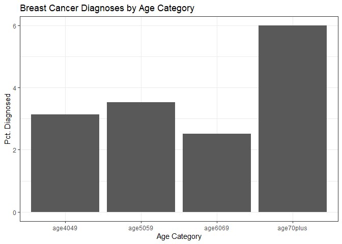
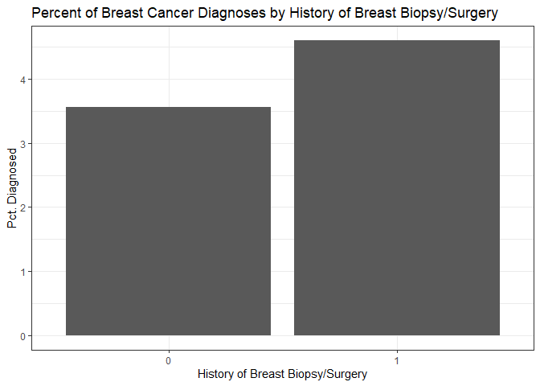
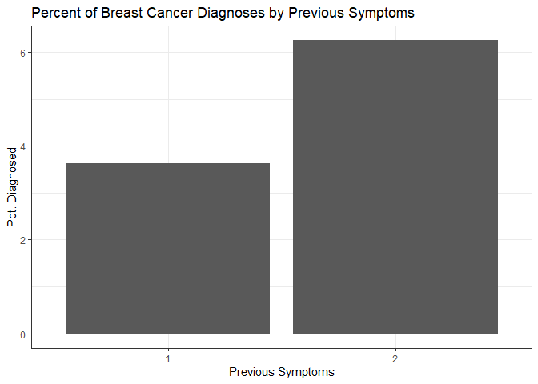
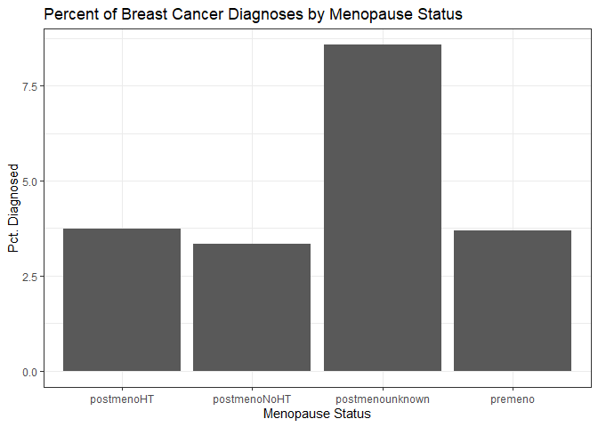

A Hospital Audit
================

Introduction
------------

The main goal of this statistical analysis is to audit the performance
of your radiologists for mammogram screenings. Each doctor wants to
limit the amount of false positives and false negatives as much as
possible, but mammograms are not perfect. Therefore, it is reasonable to
not expect 100% accuracy from your radiologists. However, we can utilize
statistical analyses in order to see how efficient the radiologists are
at recalling patients. Using the data you provided, approximately 1000
mammogram screenings from five randomly selected radiologists, we want
to examing two important questions for you:

-   Are some radiologists more clinically conservative than others in
    recalling patients, holding patient risk factors equal?
-   When the radiologists at this hospital interpret a mammogram to make
    a decision on whether to recall the patient, does the data suggest
    that they should be weighing some clinical risk factors more heavily
    than they currently are?

Conservative Radiologists
-------------------------

The naive method for analyzing conservativeness amongst your
radiologists would be to look at the raw recall rates. Radiologists with
a lower than average recall rate would be considered “conservative”.
Below is a bar chart showing the raw recall rates for each of the
radiologists in our sample.

Judging from this chart, we would say that radiologist 34 is more
conservative in recalling patients than the other radiologists. However,
this simple analysis overlooks an important nuance: Doctors might see
different patients in systematic ways that affect their recall rates.
The next step we took was to control for patient factors to see if any
radiologists are more conservative than others, holding all else fixed.
The following is the results from a logit regression model with controls
for breat cancer symptoms and breast density classification. All other
controls in the data set given had no statistically significant effect
on the probability of a recall.

    ## 
    ## ====================================================
    ##                              Dependent variable:    
    ##                          ---------------------------
    ##                                    recall           
    ## ----------------------------------------------------
    ## radiologistradiologist34           -0.521           
    ##                                    (0.326)          
    ##                                                     
    ## radiologistradiologist66            0.361           
    ##                                    (0.275)          
    ##                                                     
    ## radiologistradiologist89           0.474*           
    ##                                    (0.278)          
    ##                                                     
    ## radiologistradiologist95           -0.028           
    ##                                    (0.291)          
    ##                                                     
    ## symptoms                           0.736**          
    ##                                    (0.354)          
    ##                                                     
    ## densitydensity2                    1.251**          
    ##                                    (0.537)          
    ##                                                     
    ## densitydensity3                   1.523***          
    ##                                    (0.530)          
    ##                                                     
    ## densitydensity4                    1.160**          
    ##                                    (0.587)          
    ##                                                     
    ## Constant                          -3.183***         
    ##                                    (0.554)          
    ##                                                     
    ## ----------------------------------------------------
    ## Observations                         987            
    ## Log Likelihood                    -402.536          
    ## Akaike Inf. Crit.                  823.072          
    ## ====================================================
    ## Note:                    *p<0.1; **p<0.05; ***p<0.01

The logit regression results do not show significant coefficients for
any of the radiologists. To note, radiologist 13 is the omitted
radiologist. We see no signficanct difference for any of the other
radiologists other than radiologist 85, who has a positive (less
conservative) difference at the 10% level. It is possible that
radiologists 34 and 85 are significantly different, but we can’t really
be certain that radiologist 34 is more conservative than the others.
Overall, since we see that there aren’t any radiologists in our sample
that are significantally more conservative in recalling patients after
using a logit model to hold risk factors constant.

Importance of Clinical Risk Factors
-----------------------------------

Now, instead of analyzing what might affect the probability of a
radiologist recalling a patient, we want to see what factors best
predict the likelihood of a patient having breast cancer. To do this, we
will use a few different classification methods in order to better
understand what risk factors best predict the probability of breast
cancer.

### Null Models

To start, we want to set a baseline that we can compare following models
to. For our baseline, we use a null model which simply predicts the most
likely answer for each observation.

    ## Cancer
    ##   0   1 
    ## 950  37

The null model, in this case predicting that each patient does not have
cancer, has approximately a 96.25% accuracy rate, or equivalently a
`round(100 - (950/(950+37)*100), digits=2)`% error rate. These
statistics will be one part of our benchmark levels for evaluating the
performance of the classificaiton models we will use.

We also want to look at the current performance of radiologists at your
hospital, to see if the following statistical models would result in an
improvement in recall accuracy.

    ##       Recall
    ## Cancer   0   1
    ##      0 824 126
    ##      1  15  22

From this table, we can generate important medical statistics that will
help us compare predictions from our model against the actual decisions
of radiologists:

-   Accuracy = 85.71%
-   Sensitivity = 59.46%
-   Specificity = 86.74%
-   Positive Predictive Value = 14.86%

All of these give important information about the recall process,
therefore we will analyze all of them for each model. However, the most
important your case is the sensitivity, as the consequences of missing a
case of breast cancer are worse than incorrectly suspecting that someone
does have breast cancer. We will look at all four of these values, but
focus on the sensitivity of these models in order to limit the
possibility of missing breast cancer patients.

### Graphical Analysis

Before deciding on a model, we want to graphically look at the
relationships between the risk factors and breast cancer diagnoses. To
do this, we will graph simple two-way scatter plots for the risk factors
in question.

-   Age Category

There seems to be a positive trend with age, even though ages 60-69 are
less likely to be diagnosed with breast cancer. Patients aged 70+ are
almost twice as likely to be diagnosed with breast cancer than any other
age category.

-   History of Breast Biopsy/Surgery

-   Breast Cancer Symptoms

-   Menopause Status

-   Breast Density Classification

### Importance of Risk Factors

There are two general ways to model classification problems: Linear
Probability models (LPM), and K-Nearest Neighbors (KNN). Due to the
relative lack of cancer diagnoses and because all of the risk factors
are categorical, it makes the most sense to use a LPM instead of a KNN.
If given a larger sample of the data, KNN could be a more viable option
for modelling breast cancer probabilities.

To start, we will look at the linear probability model with all of the
risk factors and no interactions between them. To note, we will use a 5%
threshold for the limit at which a doctor should recall a patient for
further testing.

    ##    yhat
    ## y     0   1
    ##   0 716 234
    ##   1  20  17

-   Accuracy = 74.27%
-   Sensitivity = 45.95%
-   Specificity = 75.37%
-   Positive Predictive Value = 6.77%

Our base model has less accuracy, sensitivity, specificity, and positive
predictive value than what we currently observe from radiologists. To
try and improve the model, we take the two statistically significant
variables from the base model, age and density, and create a new LPM to
see if we improve any of our measures.

    ##    yhat
    ## y     0   1
    ##   0 683 267
    ##   1  20  17

-   Accuracy = 70.92%
-   Sensitivity = 45.95%
-   Specificity = 71.89%
-   Positive Predictive Value = 5.99%

This reduced model is even lower in our measures of concern, indicating
that we need to consider different models. Particularly, we want to look
at interactions between the risk factors, as having multiple
high-probability risk factors could be a better indication of the
likelihood of a breast cancer diagnosis. For the selection, we will add
the recall binary variable to control for potential unobservables that
doctors are selecting on when deciding who should be recalled. If
there’s something that the radiologists are not factoring in, we would
expect to see some of the risk factors still exhibit statistical
significance since it would improve the decision making process for the
radiologists.

    ## 
    ## =============================================
    ##                       Dependent variable:    
    ##                   ---------------------------
    ##                             cancer           
    ## ---------------------------------------------
    ## ageage5059                   0.340           
    ##                             (0.491)          
    ##                                              
    ## ageage6069                   0.218           
    ##                             (0.605)          
    ##                                              
    ## ageage70plus                1.210**          
    ##                             (0.491)          
    ##                                              
    ## densitydensity2              0.780           
    ##                             (1.074)          
    ##                                              
    ## densitydensity3              0.950           
    ##                             (1.065)          
    ##                                              
    ## densitydensity4             2.008*           
    ##                             (1.119)          
    ##                                              
    ## recall                     2.314***          
    ##                             (0.358)          
    ##                                              
    ## Constant                   -5.502***         
    ##                             (1.108)          
    ##                                              
    ## ---------------------------------------------
    ## Observations                  987            
    ## Log Likelihood             -131.467          
    ## Akaike Inf. Crit.           278.934          
    ## =============================================
    ## Note:             *p<0.1; **p<0.05; ***p<0.01

Our final model was the same as the reduced model with the addition of
the information on whether a doctor recalled a patient or not. We see
that people ages 70+ and people classified with extremely dense breasts
have a significant positive relationship with cancer diagnoses, even
after controlling for the actual recall decision. This means that if
radiologists took more consideration for those two classifications of
risk factors, they would likely be more efficient at recalling patients.
To show this, we look at one more confusion matrix of predicted
probabilities of recalling patients vs their actual diagnosis rates.

    ##    yhat
    ## y     0   1
    ##   0 821 129
    ##   1  14  23

-   Accuracy = 85.51%
-   Sensitivity = 62.16%
-   Specificity = 86.42%
-   Positive Predictive Value = 15.13%
