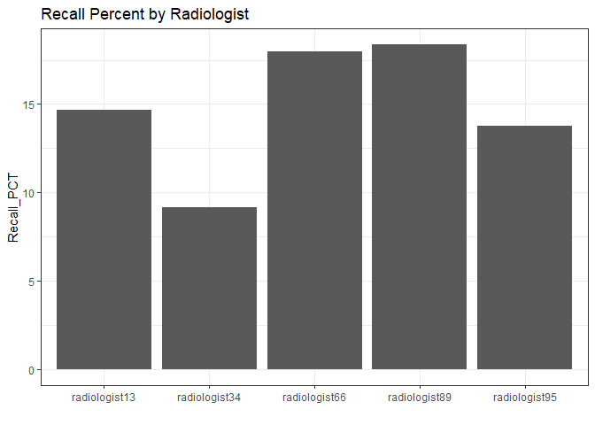

A Hospital Audit
================

Introduction
------------

The main goal of this statistical analysis is to audit the performance
of your radiologists for mammogram screenings. Each doctor wants to
limit the amount of false positives and false negatives as much as
possible, but mammograms are not perfect. Therefore, it is reasonable to
not expect 100% accuracy from your radiologists. However, we can utilize
statistical analyses in order to see how efficient the radiologists are
at recalling patients. Using the data you provided, approximately 1000
mammogram screenings from five randomly selected radiologists, we want
to examing two important questions for you:

-   Are some radiologists more clinically conservative than others in
    recalling patients, holding patient risk factors equal?
-   When the radiologists at this hospital interpret a mammogram to make
    a decision on whether to recall the patient, does the data suggest
    that they should be weighing some clinical risk factors more heavily
    than they currently are?

Conservative Radiologists
-------------------------

The naive method for analyzing conservativeness amongst your
radiologists would be to look at the raw recall rates. Radiologists with
a lower than average recall rate would be considered “conservative”.
Below is a bar chart showing the raw recall rates for each of the
radiologists in our sample.

    conserv = as.data.frame(xtabs(~ radiologist + recall, brca))

    radio_conserv = data.frame(Radiologist=levels(conserv$radiologist),
                               stringsAsFactors = FALSE)

    for (i in 1:5) {
      no_recall_raw = conserv[1, 3]
      recall_raw = conserv[i + 5, 3]
      radio_conserv[i, 2] = (recall_raw)/(no_recall_raw + recall_raw)
    }
    colnames(radio_conserv)[2] <- "Recall_PCT"

    ggplot(data = radio_conserv, mapping = aes(x = Radiologist, y = Recall_PCT)) +
      geom_col(position = "stack")

Judging from this chart, we would say that radiologist 34 is more
conservative in recalling patients than the other radiologists. However,
this simple analysis overlooks an important nuance: Doctors might see
different patients in systematic ways that affect their recall rates.
The next step we took was to control for patient factors to see if any
radiologists are more conservative than others, holding all else fixed.
The following is the results from a logit regression model with controls
for age, family history of breast biopsy, breat cancer symptoms,
menopause status, breast density classification, and whether the patient
has had a previous mammogram.

    ## 
    ## <table style="text-align:center"><tr><td colspan="2" style="border-bottom: 1px solid black"></td></tr><tr><td style="text-align:left"></td><td><em>Dependent variable:</em></td></tr>
    ## <tr><td></td><td colspan="1" style="border-bottom: 1px solid black"></td></tr>
    ## <tr><td style="text-align:left"></td><td>recall</td></tr>
    ## <tr><td colspan="2" style="border-bottom: 1px solid black"></td></tr><tr><td style="text-align:left">radiologistradiologist34</td><td>-0.522</td></tr>
    ## <tr><td style="text-align:left"></td><td>(0.328)</td></tr>
    ## <tr><td style="text-align:left"></td><td></td></tr>
    ## <tr><td style="text-align:left">radiologistradiologist66</td><td>0.355</td></tr>
    ## <tr><td style="text-align:left"></td><td>(0.279)</td></tr>
    ## <tr><td style="text-align:left"></td><td></td></tr>
    ## <tr><td style="text-align:left">radiologistradiologist89</td><td>0.464*</td></tr>
    ## <tr><td style="text-align:left"></td><td>(0.280)</td></tr>
    ## <tr><td style="text-align:left"></td><td></td></tr>
    ## <tr><td style="text-align:left">radiologistradiologist95</td><td>-0.052</td></tr>
    ## <tr><td style="text-align:left"></td><td>(0.294)</td></tr>
    ## <tr><td style="text-align:left"></td><td></td></tr>
    ## <tr><td style="text-align:left">ageage5059</td><td>0.111</td></tr>
    ## <tr><td style="text-align:left"></td><td>(0.295)</td></tr>
    ## <tr><td style="text-align:left"></td><td></td></tr>
    ## <tr><td style="text-align:left">ageage6069</td><td>0.157</td></tr>
    ## <tr><td style="text-align:left"></td><td>(0.362)</td></tr>
    ## <tr><td style="text-align:left"></td><td></td></tr>
    ## <tr><td style="text-align:left">ageage70plus</td><td>0.108</td></tr>
    ## <tr><td style="text-align:left"></td><td>(0.369)</td></tr>
    ## <tr><td style="text-align:left"></td><td></td></tr>
    ## <tr><td style="text-align:left">history</td><td>0.216</td></tr>
    ## <tr><td style="text-align:left"></td><td>(0.233)</td></tr>
    ## <tr><td style="text-align:left"></td><td></td></tr>
    ## <tr><td style="text-align:left">symptoms</td><td>0.729**</td></tr>
    ## <tr><td style="text-align:left"></td><td>(0.359)</td></tr>
    ## <tr><td style="text-align:left"></td><td></td></tr>
    ## <tr><td style="text-align:left">menopausepostmenoNoHT</td><td>-0.193</td></tr>
    ## <tr><td style="text-align:left"></td><td>(0.237)</td></tr>
    ## <tr><td style="text-align:left"></td><td></td></tr>
    ## <tr><td style="text-align:left">menopausepostmenounknown</td><td>0.403</td></tr>
    ## <tr><td style="text-align:left"></td><td>(0.464)</td></tr>
    ## <tr><td style="text-align:left"></td><td></td></tr>
    ## <tr><td style="text-align:left">menopausepremeno</td><td>0.342</td></tr>
    ## <tr><td style="text-align:left"></td><td>(0.313)</td></tr>
    ## <tr><td style="text-align:left"></td><td></td></tr>
    ## <tr><td style="text-align:left">densitydensity2</td><td>1.220**</td></tr>
    ## <tr><td style="text-align:left"></td><td>(0.539)</td></tr>
    ## <tr><td style="text-align:left"></td><td></td></tr>
    ## <tr><td style="text-align:left">densitydensity3</td><td>1.419***</td></tr>
    ## <tr><td style="text-align:left"></td><td>(0.536)</td></tr>
    ## <tr><td style="text-align:left"></td><td></td></tr>
    ## <tr><td style="text-align:left">densitydensity4</td><td>1.000*</td></tr>
    ## <tr><td style="text-align:left"></td><td>(0.602)</td></tr>
    ## <tr><td style="text-align:left"></td><td></td></tr>
    ## <tr><td style="text-align:left">Constant</td><td>-3.275***</td></tr>
    ## <tr><td style="text-align:left"></td><td>(0.640)</td></tr>
    ## <tr><td style="text-align:left"></td><td></td></tr>
    ## <tr><td colspan="2" style="border-bottom: 1px solid black"></td></tr><tr><td style="text-align:left">Observations</td><td>987</td></tr>
    ## <tr><td style="text-align:left">Log Likelihood</td><td>-399.993</td></tr>
    ## <tr><td style="text-align:left">Akaike Inf. Crit.</td><td>831.986</td></tr>
    ## <tr><td colspan="2" style="border-bottom: 1px solid black"></td></tr><tr><td style="text-align:left"><em>Note:</em></td><td style="text-align:right">*p<0.1; **p<0.05; ***p<0.01</td></tr>
    ## </table>

Predicting When Articles Go Viral
=================================

Introduction
------------
